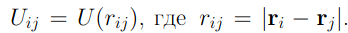
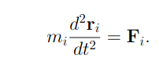
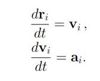
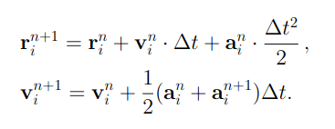
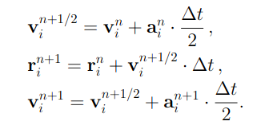
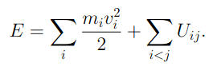

---
## Front matter
lang: ru-RU
title: "Молекулярная динамика"
subtitle: "Этап №1 "
author: "Гафиров Абдималик НФИбд-01-18; Логинов Сергей НФИбд-01-18; Мулихин Павел НФИбд-01-18; Наливайко Сергей НФИбд-01-18; Смирнова Мария НФИбд-01-18; Сорокин Андрей НФИбд-03-18"

## Formatting
mainfont: PT Serif
romanfont: PT Serif
sansfont: PT Sans
monofont: PT Mono
toc: false
slide_level: 2
theme: metropolis
header-includes:
 - \metroset{progressbar=frametitle,sectionpage=progressbar,numbering=fraction}
 - '\makeatletter'
 - '\beamer@ignorenonframefalse'
 - '\makeatother'
aspectratio: 43
section-titles: true

---

## Молекулярная динамика
Метод молекулярной динамики рассматривает поведение вещества на микроуровне - мы наблюдаем за движением отдельных молекул. При этом мы хотим понять поведение сложной многочастичной системы. Применение метода МД даже к небольшим системам, состоящим из нескольких сотен или тысяч частиц, дает много для понимания наблюдаемых свойств газов, жидкостей и твердых тел.

## Влияние молекул друг на друга
Влияние молекул друг на друга мы будем описывать потенциалом взаимодействия в его простейшем случае - парном взаимодействии:

## Движение частиц
Движение частиц мы будем описывать вторым законом Ньютона:

## Система уравнений
Перепишем полученную систему N уравнений второго порядка в виде системы 2N уравнений первого порядка. Здесь мы введем скорости и ускорения частиц:

## Алгоритм Верле
Алгоритм Верле в скоростной форме выглядит следующим образом:

## 
В таком случае нам придется использовать два массива для хранения ускорений, но мы можем переписать схему, чтобы этого избежать: 

## Выбор шага по времени
Критерием для выбора шага по времени будет служить условие сохранения полной энергии системы:

 

Приемлемым можно считать сохранение E с точностью 0,5%

## Потенциал Леннард-Джонса
Потенциал – описывает парное взаимодействие молекул. Мы будем использовать Потенциал Леннард-Джонса, который выглядит следующим образом:

 
## Начальные и граничные условия
Чтобы соотносить результаты нашей модели и гораздо большей системы нам необходимо будет задать периодические граничные условия.
 
## Выводы
Обобщим нашу задачу. Мы хотим написать программу двумерной молекулярной динамики. Для этого нам необходимо:

1. Задать начальные условия с нулевым суммарным импульсом частиц. 
2. Граничные условия задать периодическими. 
3. Подобрать подходящий шаг по времени. 
4. Проверить сохранение полной энергии и импульса

