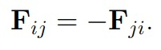

---
## Front matter
lang: ru-RU
title: "Молекулярная динамика"
subtitle: "Этап №2 "
author: "Гафиров Абдималик НФИбд-01-18; Логинов Сергей НФИбд-01-18; Мулихин Павел НФИбд-01-18; Наливайко Сергей НФИбд-01-18; Смирнова Мария НФИбд-01-18; Сорокин Андрей НФИбд-03-18"

## Formatting
mainfont: PT Serif
romanfont: PT Serif
sansfont: PT Sans
monofont: PT Mono
toc: false
slide_level: 2
theme: metropolis
header-includes:
 - \metroset{progressbar=frametitle,sectionpage=progressbar,numbering=fraction}
 - '\makeatletter'
 - '\beamer@ignorenonframefalse'
 - '\makeatother'
aspectratio: 43
section-titles: true

---

## Метод молекулярной динамики
Метод молекулярной динамики (МД) рассматривает поведение вещества на микроуровне - мы наблюдаем за движением отдельных молекул. При этом мы хотим понять поведение сложной многочастичной системы. Применение метода МД даже к небольшим системам, состоящим из нескольких сотен или тысяч частиц, дает много для понимания наблюдаемых свойств газов, жидкостей и твердых тел.

##
Мы вывели 2N уравнений первого порядка (N — число частиц):

## Алгоритм Верле
Алгоритм Верле в скоростной форме выглядит следующим образом:

##
Нам придется использовать два массива для хранения ускорений, но мы можем переписать схему, чтобы этого избежать: 

## 1. Начальные условия
Необходимо ввести начальные условия:

При этом суммарный импульс частиц должен быть равен 0.

## 2. Граничные условия
Граничные условия зададим периодическими:

## 3. Вычисление ускорений
Так как мы переписали уравнения движения, необходимо перед интегрированием вычислить значения ускорений, в соответствии с третим законом Ньютона:

## 4. Выбор шага по времени
Критерием для выбора шага по времени будет служить условие сохранения полной энергии системы:

 

Приемлемым можно считать сохранение E с точностью 0,5%

## 5. Потенциал Леннард-Джонса
Потенциал – описывает парное взаимодействие молекул. Мы будем использовать Потенциал Леннард-Джонса, который выглядит следующим образом:

## 6. Интегрирование уравнений движения

Последний шаг нашего алгоритма - интегрирование уравнений движения в цикле по времени.

# Выводы: На втором этапе проекта мы построили алгоритм для программы  двумерной молекулярной динамики

