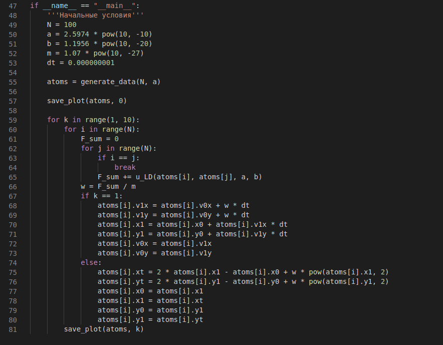

---
## Front matter
lang: ru-RU
title: "Молекулярная динамика"
subtitle: "Этап №3 "
author: "Гафиров Абдималик НФИбд-01-18; Логинов Сергей НФИбд-01-18; Мулихин Павел НФИбд-01-18; Наливайко Сергей НФИбд-01-18; Смирнова Мария НФИбд-01-18; Сорокин Андрей НФИбд-03-18"

## Formatting
mainfont: PT Serif
romanfont: PT Serif
sansfont: PT Sans
monofont: PT Mono
toc: false
slide_level: 2
theme: metropolis
header-includes:
 - \metroset{progressbar=frametitle,sectionpage=progressbar,numbering=fraction}
 - '\makeatletter'
 - '\beamer@ignorenonframefalse'
 - '\makeatother'
aspectratio: 43
section-titles: true

---

# Ход работы

## Общие сведения

Для примера возьмем атом меди со следующими начальными условиями 

$$N = 100$$
$$a = 2.5974 * 10^{-10}$$
$$b = 1.1956 * 10^{-20}$$
$$m = 1.07 * 10^{-27}$$

Составим программный код, который будет моделировать поведение атомов меди.

## Программный код

{ width=70% }

## Результат

{ width=70% }

# Вывод

## Вывод

В ходе третьего этапа проекта мы смоделировали процесс двумерной молекулярной динамики
