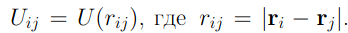
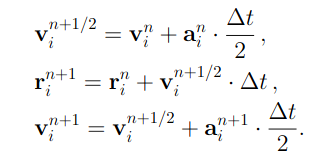
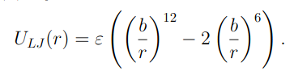
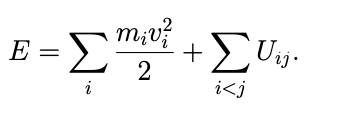
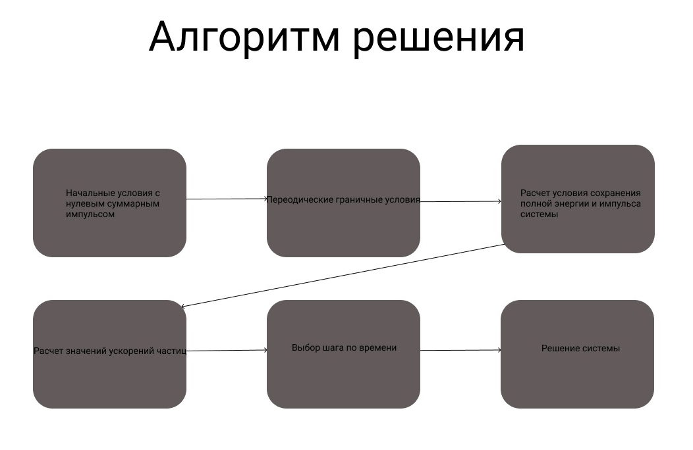
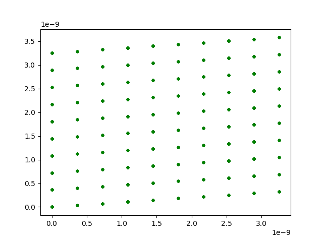

---
## Front matter
lang: ru-RU
title: "Молекулярная динамика"
subtitle: "Этап №4 "
author: "Гафиров Абдималик НФИбд-01-18; Логинов Сергей НФИбд-01-18; Мулихин Павел НФИбд-01-18; Наливайко Сергей НФИбд-01-18; Смирнова Мария НФИбд-01-18; Сорокин Андрей НФИбд-03-18"

## Formatting
mainfont: PT Serif
romanfont: PT Serif
sansfont: PT Sans
monofont: PT Mono
toc: false
slide_level: 2
theme: metropolis
header-includes:
 - \metroset{progressbar=frametitle,sectionpage=progressbar,numbering=fraction}
 - '\makeatletter'
 - '\beamer@ignorenonframefalse'
 - '\makeatother'
aspectratio: 43
section-titles: true

---

## Подведение итогов по всем этапам
На четвертом этапе мы бы хотели подвести итоги нашего проекта.

## Первый этап. Молекулярная динамика
На первом этапе мы узнали, что такое Молекулярная динамика (МД) и как молекулы влияют друг на друга.
Их мы описали потенциалом взаимодействия в его простейшем случае - парном взаимодействии:

##
Так же мы ввели алгоритм Верле в скоростной форме, но мы переписали схему, чтобы избежать использование двух массивов для хранения ускорений:

## 
Мы использовали Потенциал Леннард-Джонса, который выглядит следующим образом:

 
## Второй этап. Метод молекулярной динамики
На втором этами мы узнали, что метод молекулярной динамики рассматривает поведение вещества на микроуровне. Применение метода МД даже к небольшим системам, состоящим из нескольких сотен или тысяч частиц, дает много для понимания наблюдаемых свойств газов, жидкостей и твердых тел.

## 
Используя алгоритм Верле, представленный выше, мы так же вычислили значения ускорений перед
началом цикла по времени:

## 
В конечном итоге второго этапа мы построили алгоритм для программы двумерной молекулярной динамики: 

## Третий этап. Кристаллическая решетка меди
В ходе третьего этапа проекта мы смоделировали процесс двумерной молекулярной динамики и получили кристаллическую решетку меди: 

## Вывод

В нашем проекте мы познакомились и изучили Молекулярную динамику, построили алгоритм решения проблемы и смоделировали процесс двумерной молекулярной динамики 

