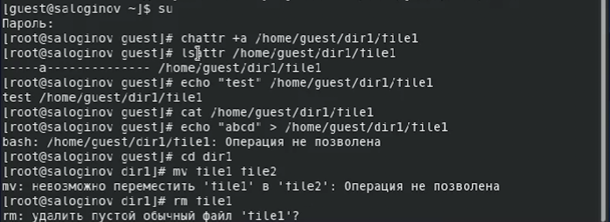
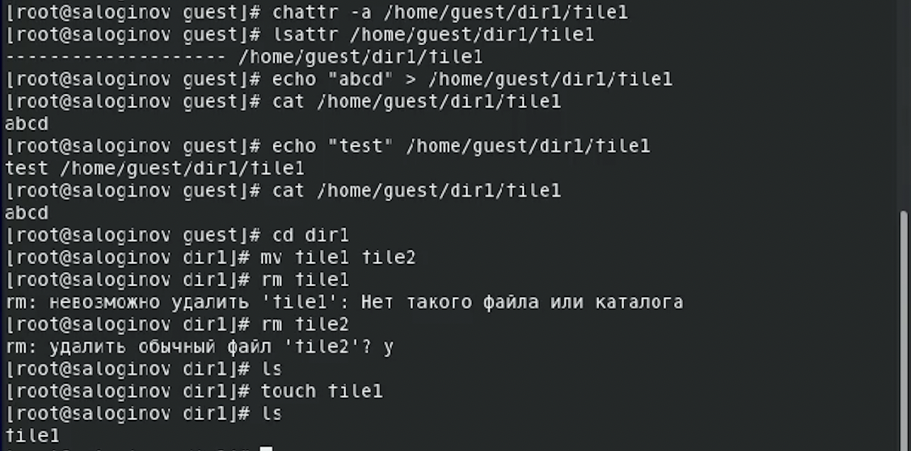

### **РОССИЙСКИЙ УНИВЕРСИТЕТ ДРУЖБЫ НАРОДОВ**

### **Факультет физико-математических и естественных наук**

### **Кафедра прикладной информатики и теории вероятностей**

### **Отчет по лабораторной работе № 4**

### *Дисциплина: Информационная безопасность*

Студент:	Логинов Сергей Андреевич

Группа:	  НФИбд-01-18 

​		

​																		

​	**МОСКВА 2021г**

### Цель работы

Получение практических навыков работы в консоли с расширенными атрибутами файлов.

### Ход работы

1.  От имени пользователя guest определим расширенные атрибуты файла */home/guest/dir1/file1* командой *lsattr /home/guest/dir1/file1*
2. Установим командой *chmod 600 file1* на файл права, разрещающие чтение и запись для владельца файла
3. Попробуем установить на файл */home/guest/dir1/file1* расширенный атрибут a от имени пользователя guest: *chattr +a /home/guest/dir1/file1* 

Получаем отказ везде:

4. Воспользуемся правами суперпользователя и установим расширенный атрибут a на файл */home/guest/dir1/file1*
5. Проверим правильность установки атрибута
6. Выполним дозапись в файл
7. Попробуем переименовать и удалить файл
8. Попробуем с помощью команды *chmod 000 file1* установить на файл права, запрещающие чтение и запись для владельца файла

Удалось установить атрибут, однако во всех следующих пунктах получили отказ(кроме дозаписи)

9. Снимем расширенный атрибут с файла и повторим операции, которые ранее не удалось выполнить

На этот раз все выполнилось успешно

10. Повторим действия по шагам с установленным атрибутом **i**. 

Во всех шагах получаем отказ. Следовательно, атрибут i запрещает любые изменения файла, а атрибут а разрешает только дозапись.

### Вывод

В ходе лабораторной работы получены навыки использования расширенных атрибутов файлов.