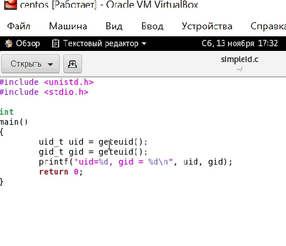
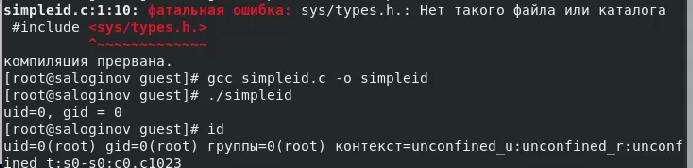
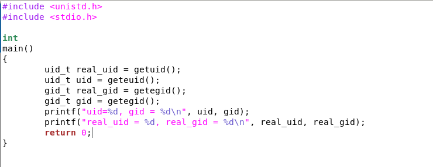
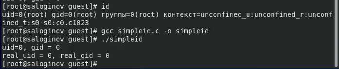
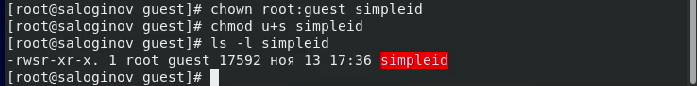
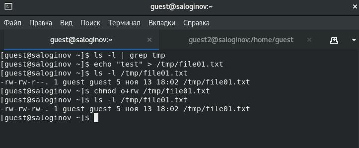
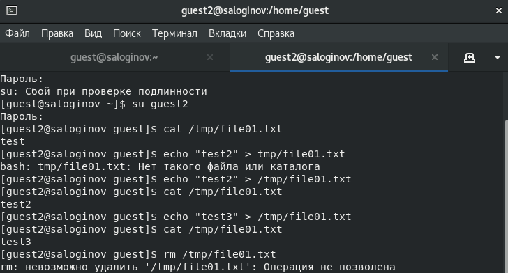
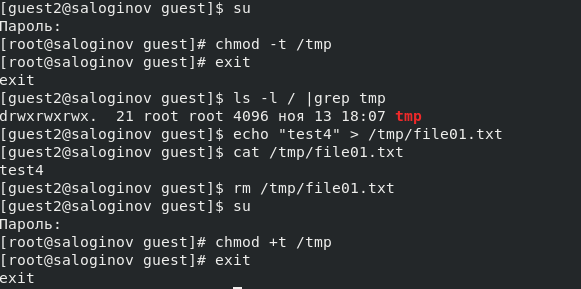

## **РОССИЙСКИЙ УНИВЕРСИТЕТ ДРУЖБЫ НАРОДОВ**

### **Факультет физико-математических и естественных наук**

### **Кафедра прикладной информатики и теории вероятностей**

## **ОТЧЕТ ПО ЛАБОРАТОРНОЙ РАБОТЕ № 5**

###  *дисциплина: Информационная безопасность*

Студент:	Логинов Сергей Андреевич

Группа:	  НФИбд-01-18 

​													

​										

​	**МОСКВА 2021г**

## Выполнение

1. Создание программы

От имени пользователя guest создали программу simpleid.c:

В установленной системе отсутствует библиотека types.h, поэтому пришлось удалить ее из кода

Выполнили программу simpleid и системную программу id

Результаты выполнения одинаковые

Усложнили программу, добавив вывод действительных идентификаторов

Запустили программу и сравнили вывод

От имени суперпользователя выполнили команды 

chown root:guest /home/guest/simpleid2  - команда для смены владельца файла

chmod u+s /home/guest/simpleid2 - команда для изменения прав доступа файла

Выполнили проверку правильности установки новых атрибутов и смены владельца файла simpleid2: 

ls -l simpleid2

Программу readfile создать не удалось из-за проблем с библиотеками

2. Исследование Sticky-бита

Выяснили,что атрибут Sticky установлен на директории /tmp

От имени пользователя guest создали файл file01.txt в директории /tmp со словом test

Просмотрели атрибуты у только что созданного файла и разрешили чтение и запись для категории пользователей «все остальные»:

От пользователя guest2 (не являющегося владельцем) прочитали файл /tmp/file01.txt

От пользователя guest2 дозаписали в файл /tmp/file01.txt слово test2

От пользователя guest2 записали в файл /tmp/file01.txt слово test3, стерев при этом всю имеющуюся в файле информацию

Попробовали удалить файл и получили отказ:

Повысили права до суперпользователя и сняли атрибут t с директории /tmp

Вышли из режима суперпользователя и повторили действия, теперь удаление прошло успешно

Вернули атрибут t на директорию /tmp

