### **РОССИЙСКИЙ УНИВЕРСИТЕТ ДРУЖБЫ НАРОДОВ**

### **Факультет физико-математических и естественных наук**

### **Кафедра прикладной информатики и теории вероятностей**


### **Отчет по лабораторной работе № 6**

### *Дисциплина: Информационная безопасность*


Студент:	Логинов Сергей Андреевич

Группа:	  НФИбд-01-18 


​																							

​	**МОСКВА 2021г**

### Цель работы

Развить навыки администрирования ОС Linux. Получить первое практическое знакомство с технологией SELinux.

Проверить работу SELinux на практике совместно с веб-сервером Apache.

### Ход работы

Были выполнены подготовительные процедуры и установлены необходимые пакеты.

1. Убедились, что SELinux работает в режиме enforcing политики targeted

2. С помощью веб-браузера обратились к локальному веб-серверу и убедились. что он работает

   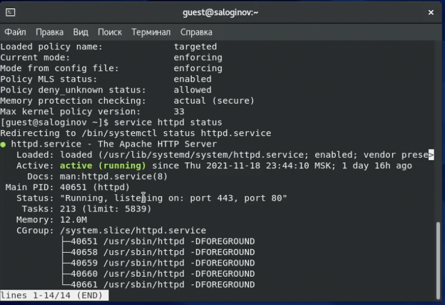

3. Нашли веб-сервер Apache в списке процессов, контекст безопасности: 
   system_u:system_r:httpd_t:s0

   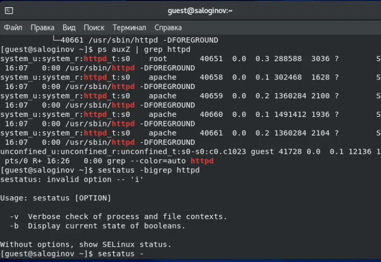

4. Проверили текущее состояние переключателей SELinux для Apache

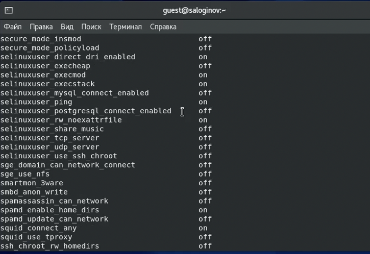	Действительно, большая часть переключателей находится в положении off

5. Посмотрели статистику по политике. Множество пользователей: 8, ролей: 14, типов: 4958
   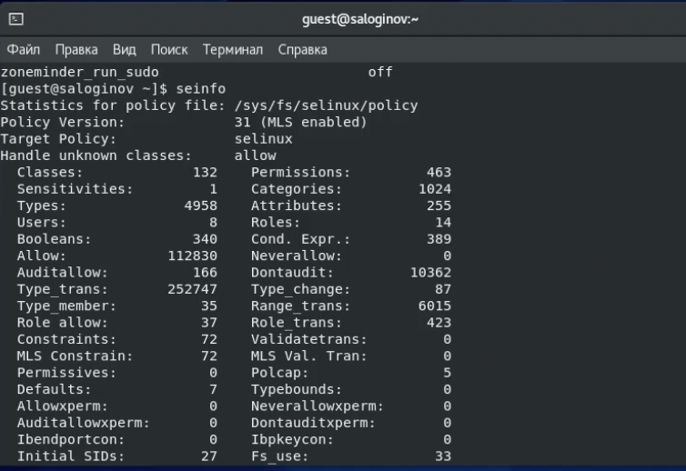

6. Определили тип файлов и поддиректорий, находящихся в директории /var/www 

7. В директории /var/www/html отсутсвтуют какие-либо файлы

8. В данной директории файлы создавать может только владелец 

9. От имени суперпользователя создали html-файл следующего содержания:

   ```html
   <html>
   <body>test</body>
   </html>
   ```

   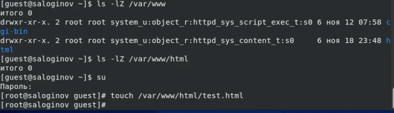

10. Проверили контекст созданного файла:

    unconfined_u:object_r:httpd_sys_content_t:s0

    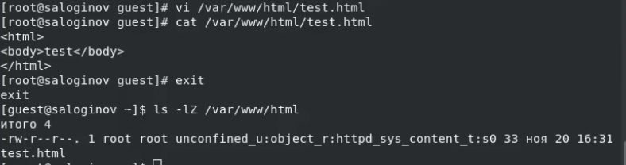

11. Обратились к файлу через веб-сервер
    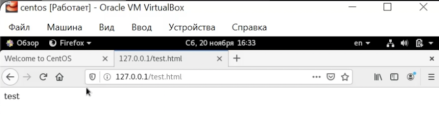

12. Изучили справку SELinux

13. Изменили контекст файла с httpd_sys_content_t на samba_share_t
    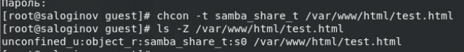

14. Снова попробовали обратиться к файлу через веб-сервер, получили отказ
    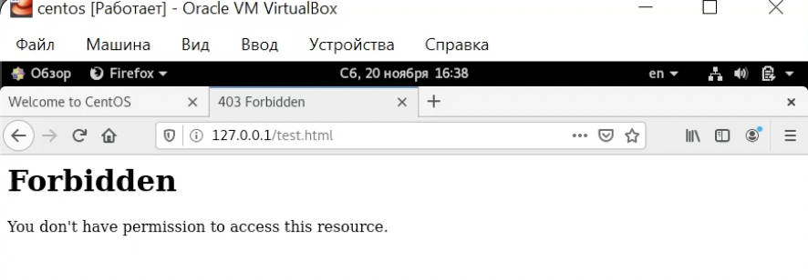

15. Несмотря на то, что права доступа дают возможность читать файл любому пользователю, обратиться к нему через браузер не получилось, поскольку на файл был установлен другой контекст. Тип samba_share_t не позволяет процессу httpd получить доступ к файлу при обращении через браузер
    Логи:
    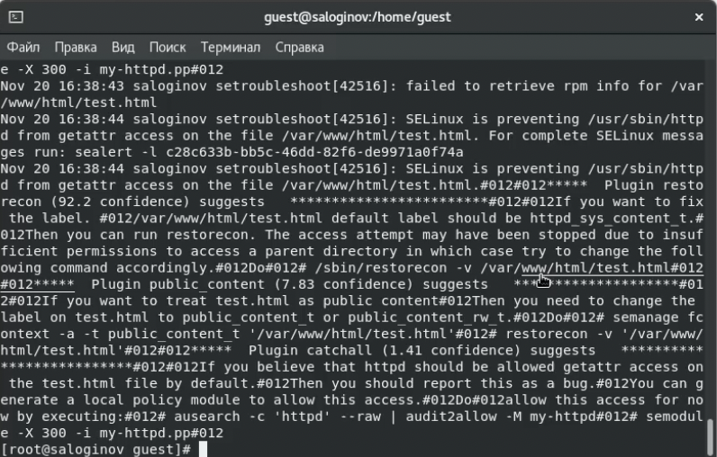

16. При попытке запустить веб-сервер на прослушивание TCP-порта 81 было выявлено, что 81 порт уже присутствует в списке стандартных портов, которые невозможно удалить. Следовательно, пункты 16-20 не выполнены

21. Вернули контекст нашему файлу и через браузер получили доступ к нему
    
22. Файл отсутствует
23. Невозможно удалить
    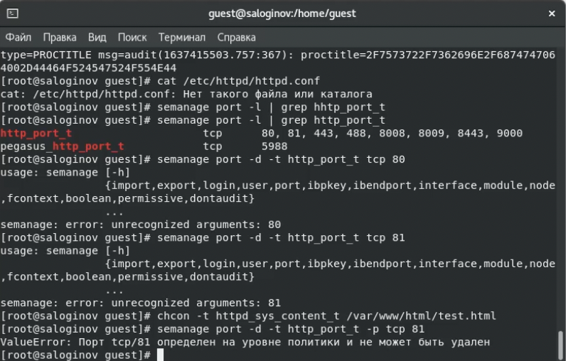
24. Удалили файл test.html


### Вывод

В ходе лабораторной работы были получены первые практические навыки работы с SELinux
