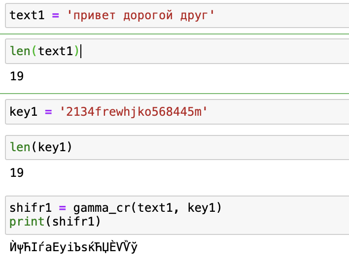
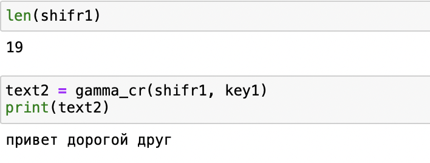
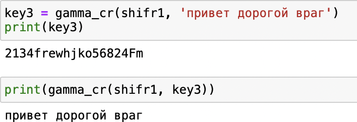
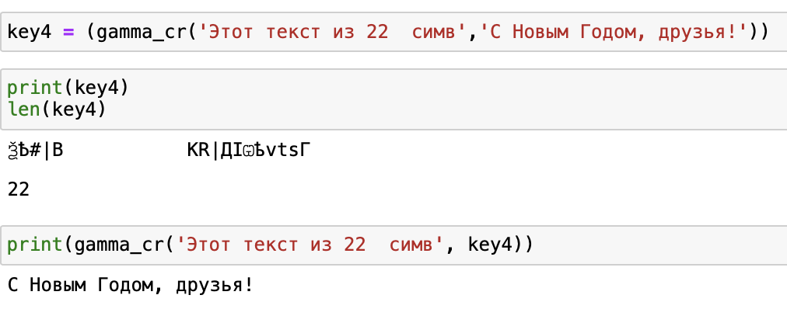

### **РОССИЙСКИЙ УНИВЕРСИТЕТ ДРУЖБЫ НАРОДОВ**

### **Факультет физико-математических и естественных наук**

### **Кафедра прикладной информатики и теории вероятностей**


### **Отчет по лабораторной работе № 7**

### *Дисциплина: Информационная безопасность*


Студент:	Логинов Сергей Андреевич

Группа:	  НФИбд-01-18 


​																							

​															**МОСКВА 2021г**

### Элементы криптографии. Однократное гаммирование

*Гаммирование* представляет собой наложение (снятие) на открытые (за- шифрованные) данные последовательности элементов других данных, полученной с помощью некоторого криптографического алгоритма, для по- лучения зашифрованных (открытых) данных. Иными словами, наложение гаммы — это сложение её элементов с элементами открытого (закрытого) текста по некоторому фиксированному модулю, значение которого представляет собой известную часть алгоритма шифрования.

В соответствии с теорией криптоанализа, если в методе шифрования используется однократная вероятностная гамма (однократное гаммирование) той же длины, что и подлежащий сокрытию текст, то текст нельзя раскрыть. Даже при раскрытии части последовательности гаммы нельзя получить ин- формацию о всём скрываемом тексте.

Наложение гаммы по сути представляет собой выполнение операции *сложения по модулю 2 (XOR)* (обозначаемая знаком ⊕) между элементами гаммы и элементами подлежащего сокрытию текста. Напомним, как работает операция XOR над битами: 0 ⊕ 0 = 0, 0 ⊕ 1 = 1, 1 ⊕ 0 = 1, 1 ⊕ 1 = 0.

Такой метод шифрования является симметричным, так как двойное прибавление одной и той же величины по модулю 2 восстанавливает исходное значение, а шифрование и расшифрование выполняется одной и той же программой.

Если известны ключ и открытый текст, то задача нахождения шифротекста заключается в применении к каждому символу открытого текста следующего правила:
$$
C_i = P_i ⊕ K_i
$$
где C— i-й символ получившегося зашифрованного послания, P — i-й символ открытого текста, K — i-й символ ключа, i = 1, m. Размерности открытого текста и ключа должны совпадать, и полученный шифротекст будет такой же длины.

### Задание

Нужно подобрать ключ, чтобы получить сообщение «С Новым Годом, друзья!». Требуется разработать приложение, позволяющее шифровать и дешифровать данные в режиме однократного гаммирования. Приложение должно:

1. Определить вид шифротекста при известном ключе и известном откры- том тексте.
2. Определить ключ, с помощью которого шифротекст может быть преоб- разован в некоторый фрагмент текста, представляющий собой один из возможных вариантов прочтения открытого текста.

**Замечание**:

Некоторые ключи не отображаются в браузере (из-за специфичных символов), но они существуют и имеют нужную длину.

1. Напишем универсальную функцию, которая будет проводить шифрования, расшифровку и подбор ключа

```python
from itertools import zip_longest
def gamma_cr(text, key):
    shifr = ''
    for (x, y) in zip_longest(text, key):
        if not x:
            break
        shifr += chr((ord(x) ^ ord(y)))
    return shifr
```

Проведем шифрование текста "привет дорогой друг" с помощью случайного ключа такой же длины:




Выполним проверку:

Вызовем функцию с шифром и тем же ключом в качестве аргумента



2. Подберем ключ для того, чтобы текст "привет дорогой друг" был расшифрован как "привет дорогой враг"

   

3. Подберем ключ, чтобы некоторый текст был расшифрован как "С новым годом друзья!"							

### Вывод

На практике освоили режим однократного гаммирования
