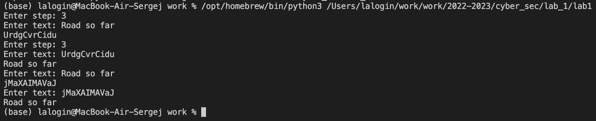

# Логинов Сергей
# Лабораторная работа № 1
# Цель работы

Изучение алгоритмов шифрования Цезаря и Атбаш

# Теоретические сведения

## Шифр Цезаря

Шифр Цезаря, также известный, как шифр сдвига, код Цезаря или сдвиг Цезаря — один из самых простых и наиболее широко известных методов шифрования.

Шифр Цезаря — это вид шифра подстановки, в котором каждый символ в открытом тексте заменяется символом находящимся на некотором постоянном числе позиций левее или правее него в алфавите. Например, в шифре со сдвигом 3 А была бы заменена на Г, Б станет Д, и так далее.

Шифр назван в честь римского императора Гая Юлия Цезаря, использовавшего его для секретной переписки со своими генералами.

Шаг шифрования, выполняемый шифром Цезаря, часто включается как часть более сложных схем, таких как шифр Виженера, и все ещё имеет современное приложение в системе ROT13. Как и все моноалфавитные шифры, шифр Цезаря легко взламывается и не имеет практически никакого применения на практике.

Если сопоставить каждому символу алфавита его порядковый номер (нумеруя с 0), то шифрование и дешифрование можно выразить формулами модульной арифметики:

```
y = (x + k) mod n
x = (y - k + n) mod n
```

где
*x — символ открытого текста,
*y — символ шифрованного текста
*n — мощность алфавита
*k — ключ.

С точки зрения математики шифр Цезаря является частным случаем аффинного шифра.

## Шифр Атбаш

Атбаш — простой шифр подстановки, изначально придуманный для иврита. Правило шифрования состоит в замене i-й буквы алфавита буквой с номером n − i + 1, где n — число букв в алфавите.

# Выполнение работы

## Реализация шифра Цезаря и его дешифровки на языке Python
```
#'ABCDEFGHIJKLMNOPQRSTUVWXYZabcdefghijklmnopqrstuvwxyz ABCDEFGHIJKLMNOPQRSTUVWXYZabcdefghijklmnopqrstuvwxyz '
def cesar():
    alph = 'ABCDEFGHIJKLMNOPQRSTUVWXYZabcdefghijklmnopqrstuvwxyz ABCDEFGHIJKLMNOPQRSTUVWXYZabcdefghijklmnopqrstuvwxyz '
    step = int(input('Enter step: '))
    text = input('Enter text: ')
    result = ''
    for i in text:
        indx = alph.find(i)
        newindx = indx + step
        if i in alph:
            result += alph[newindx]
        else:
            result += i
    print(result)

def def_cesar():
    alph = 'ABCDEFGHIJKLMNOPQRSTUVWXYZabcdefghijklmnopqrstuvwxyz ABCDEFGHIJKLMNOPQRSTUVWXYZabcdefghijklmnopqrstuvwxyz '
    step = int(input('Enter step: '))
    text = input('Enter text: ')
    result = ''
    for i in text:
        indx = alph.find(i)
        newindx = indx - step
        if i in alph:
            result += alph[newindx]
        else:
            result += i
    print(result)
## Реализация шифра Атбаша и его дешифровки на языке Python
def atbash():
    alph = "ABCDEFGHIJKLMNOPQRSTUVWXYZabcdefghijklmnopqrstuvwxyz "
    alph_r = alph[::-1]
    text = input('Enter text: ')
    result = ''
    for i in text:
        for j, k in enumerate(alph):
            if i == k:
                result += alph_r[j]               
    print(result)

def def_atbash():
    alph = "ABCDEFGHIJKLMNOPQRSTUVWXYZabcdefghijklmnopqrstuvwxyz "
    alph_r = alph[::-1]
    text = input('Enter text: ')
    result = ''
    for i in text:
        for j, k in enumerate(alph_r):
            if i == k:
                result += alph[j]                
    print(result)

for func in [cesar, def_cesar, atbash, def_atbash]:
    func()
```
## Контрольный пример



# Выводы

Изучили алгоритмы шифрования Цезаря и Атбаш.

# Список литературы

1. [Шифр Цезаря](https://habr.com/ru/post/534058/)
2. [Шифр Атбаш](https://habr.com/ru/post/444176/)
