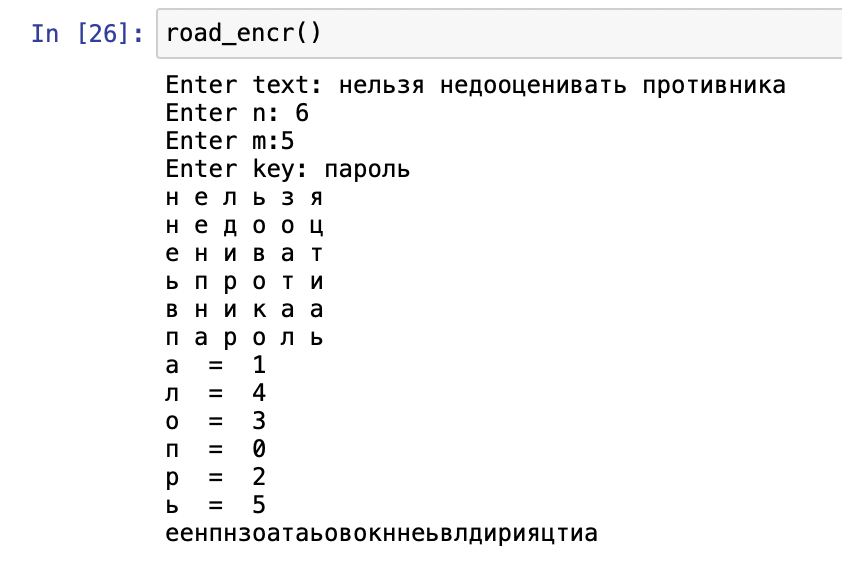
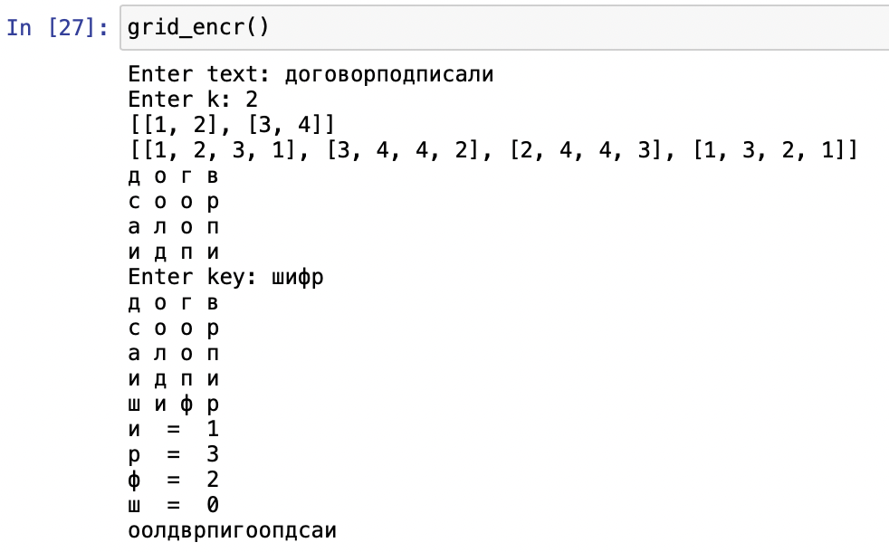
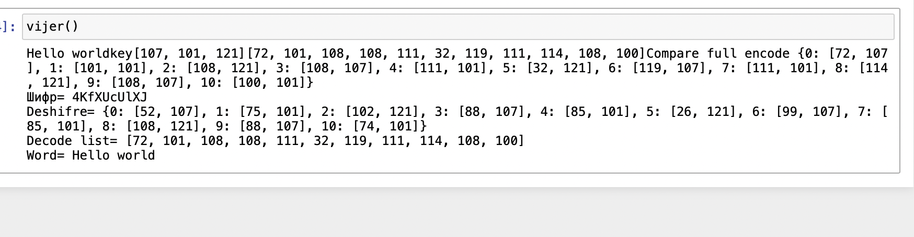

# Лабораторная работа №2

# Логинов Сергей НФИмд-01-22

# Цель работы

Изучение алгоритмов маршрутной перестановки, решеток и Виженера

# Теоретические сведения

## Шифр маршрутной перестановки

Широкое распространение получили шифры перестановки, использующие некоторую геометрическую фигуру. Преобразования из этого шифра состоят в том, что в фигуру исходный текст вписывается по ходу одного ``маршрута'', а затем по ходу другого выписывается с нее. Такой шифр называют маршрутной перестановкой. Например, можно вписывать исходное сообщение в прямоугольную таблицу, выбрав такой маршрут: по горизонтали, начиная с левого верхнего угла поочередно слева направо и справа налево. Выписывать же сообщение будем по другому маршруту: по вертикали, начиная с верхнего правого угла и двигаясь поочередно сверху вниз и снизу вверх.

## Шифр Кардано

Решётка Кардано — инструмент кодирования и декодирования, представляющий собой специальную прямоугольную (в частном случае — квадратную) таблицу-карточку, четверть ячеек которой вырезана.

Таблица накладывается на носитель, и в вырезанные ячейки вписываются буквы, составляющие сообщение. После переворачивания таблицы вдоль вертикальной оси, процесс вписывания букв повторяется. Затем то же самое происходит после переворачивания вдоль горизонтальной и снова вдоль вертикальной осей.

В частном случае квадратной таблицы, для получения новых позиций для вписывания букв, можно поворачивать квадрат на четверть оборота.

Чтобы прочитать закодированное сообщение, необходимо наложить решётку Кардано нужное число раз на закодированный текст и прочитать буквы, расположенные в вырезанных ячейках.

Такой способ шифрования сообщения был предложен математиком Джероламо Кардано в 1550 году, за что и получил своё название.

## Шифр Виженера

Шифр Виженера (фр. Chiffre de Vigenère) — метод полиалфавитного шифрования буквенного текста с использованием ключевого слова.

Этот метод является простой формой многоалфавитной замены. Шифр Виженера изобретался многократно. Впервые этот метод описал Джован Баттиста Беллазо (итал. Giovan Battista Bellaso) в книге La cifra del. Sig. Giovan Battista Bellasо в 1553 году, однако в XIX веке получил имя Блеза Виженера, французского дипломата. Метод прост для понимания и реализации, он является недоступным для простых методов криптоанализа.

В шифре Цезаря каждая буква алфавита сдвигается на несколько строк; например в шифре Цезаря при сдвиге +3, A стало бы D, B стало бы E и так далее. Шифр Виженера состоит из последовательности нескольких шифров Цезаря с различными значениями сдвига. Для зашифровывания может использоваться таблица алфавитов, называемая tabula recta или квадрат (таблица) Виженера. Применительно к латинскому алфавиту таблица Виженера составляется из строк по 26 символов, причём каждая следующая строка сдвигается на несколько позиций. Таким образом, в таблице получается 26 различных шифров Цезаря. На каждом этапе шифрования используются различные алфавиты, выбираемые в зависимости от символа ключевого слова.

# Выполнение работы
```
import sys

def matrix_print(lists):
    for i in lists:
        for j in i:
            print(j, end=" ")
        print()
```
## Реализация шифра маршрутной перестановки на языке Python

```
def road_encr():
    text = input("Enter text: ").replace(' ', '')
    n = int(input("Enter n: "))
    m = int(input("Enter m:")) 
    parol = input("Enter key: ")
    matrix = [['a' for i in range(0, n)] for j in range(m)] 
    iterator = 0 
    for i in range(m):
        for j in range(n):
            if iterator < len(text):
                matrix[i][j] = text[iterator]
                iterator += 1
    key_list = list()
    for i in range(n):
        key_list.append(parol[i])
    matrix.append(key_list)
    matrix_print(matrix)
    result = "" 
    sorted_key = sorted(matrix[len(matrix) - 1])
    for i in sorted_key: 
        print(i, " = ", matrix[len(matrix)-1].index(i))
        for j in range(len(matrix)):
            if j==len(matrix)-1:
                continue
            result += matrix[j][matrix[len(matrix)-1].index(i)]
    print(result)
```

## Реализация шифра решеткой на языке Python

```
def rot90(matrix):
    return[list(reversed(col)) for col in zip(*matrix)]

def del_el(largelist, inn, k):
    for i in range(k * 2):
        for j in range(k * 2):
            if largelist[i][j] == inn:
                largelist[i][j] = " "
                return


def grid_encr(): 
    text = input('Enter text: ')
    k = int(input("Enter k: "))
    s=1
    matrix = [[i for i in range(k)] for i in range(k)] 
    for i in range(k):
        for j in range(k):
            matrix[i][j] = s
            s += 1
    print(matrix)
    matrix1 = rot90(matrix) 
    matrix2 = rot90(matrix1)
    matrix3 = rot90(matrix2)
    largelist = [[1 for i in range(2*k)] for i in range(2*k)]
    for i in range(k):
        for j in range(k):
            largelist[i][j] = matrix[i][j]
    i1 = 0
    j1 = 0
    for i in range(0, k):
        for j in range(k, k*2):
            largelist[i][j] = matrix1[i1][j1]
            j1 += 1
        j1 = 0
        i1 += 1
    i1 = 0
    j1 = 0
    for i in range(k, k*2):
        for j in range(k, k * 2):
            largelist[i][j] = matrix2[i1][j1]
            j1 += 1
        j1 = 0
        i1 += 1
    i1 = 0
    j1 = 0
    for i in range(k, k * 2):
        for j in range(0, k):
            largelist[i][j] = matrix3[i1][j1]
            j1 += 1
        j1 = 0
        i1 += 1
    print(largelist)
    largelist_a = [[" " for i in range(2*k)] for i in range(2*k)]
    s = 0
    li = [i for i in range(1,k**2+1)]
    for inn in li:
        del_el(largelist, inn, k)
    ind = 0
    for i in range(k * 2):
        for j in range(k * 2):
            if largelist[i][j] == largelist_a[i][j] and len(text) > 0:
                largelist_a[i][j] = text[0]
                text = text[1:]
    largelist = rot90(largelist)
    for i in range(k * 2):
        for j in range(k * 2):
            if largelist[i][j] == largelist_a[i][j] and len(text) > 0:
                largelist_a[i][j] = text[0]
                text = text[1:]
    if len(text) > 0:
        largelist = rot90(largelist)
        for i in range(k * 2):
            for j in range(k * 2):
                if largelist[i][j] == largelist_a[i][j] and len(text) > 0:
                    largelist_a[i][j] = text[0]
                    text = text[1:]
    if len(text) > 0:
        largelist = rot90(largelist)
        for i in range(k * 2):
            for j in range(k * 2):
                if largelist[i][j] == largelist_a[i][j] and len(text) > 0:
                    largelist_a[i][j] = text[0]
                    text = text[1:]
    matrix_print(largelist_a)
    stri = input("Enter key: ")
    if len(stri) > k*2:
        stri = stri[:k*2]
    elif len(stri) < k*2:
        while len(stri) != k*2:
            stri += "z"
    largelist_a.append(list(stri))
    matrix_print(largelist_a)
    result = ""
    spisok = sorted(largelist_a[len(largelist_a) - 1])
    for i in spisok:
        print(i, " = ", largelist_a[len(largelist_a) - 1].index(i))
        for j in range(len(largelist_a)):
            if j==len(largelist_a)-1:
                continue
            result += largelist_a[j][largelist_a[len(largelist_a) - 1].index(i)]
    print(result.replace(" ", ""))
```

## Реализация шифра Виженера на языке Python

```
def form_dict():
    d = {}
    iter = 0
    for i in range(0,127):
        d[iter] = chr(i)
        iter = iter +1
    return d

def encode_val(word):
    list_code = []
    lent = len(word)
    d = form_dict()

    for w in range(lent):
        for value in d:
            if word[w] == d[value]:
               list_code.append(value)
    return list_code

def comparator(value, key):
    len_key = len(key)
    dic = {}
    iter = 0
    full = 0

    for i in value:
        dic[full] = [i,key[iter]]
        full = full + 1
        iter = iter +1
        if (iter >= len_key):
            iter = 0
    return dic


def full_encode(value, key):
    dic = comparator(value, key)
    print('Compare full encode', dic)
    lis = []
    d = form_dict()

    for v in dic:
        go = (dic[v][0]+dic[v][1]) % len(d)
        lis.append(go)
    return lis


def decode_val(list_in):
    list_code = []
    lent = len(list_in)
    d = form_dict()

    for i in range(lent):
        for value in d:
            if list_in[i] == value:
               list_code.append(d[value])
    return list_code

def full_decode(value, key):
    dic = comparator(value, key)
    print('Deshifre=', dic)
    d = form_dict()
    lis =[]

    for v in dic:
        go = (dic[v][0]-dic[v][1]+len(d)) % len(d)
        lis.append(go)
    return lis

def vijer():
    word = "Hello world"
    key = "key"
    sys.stdout.write(word)
    sys.stdout.write(key)
    key_encoded = encode_val(key)
    value_encoded = encode_val(word)
    sys.stdout.write(str(key_encoded))
    sys.stdout.write(str(value_encoded))
    shifre = full_encode(value_encoded, key_encoded)
    print('Шифр=', ''.join(decode_val(shifre)))

    decoded = full_decode(shifre, key_encoded)
    print('Decode list=', decoded)
    decode_word_list = decode_val(decoded)
    print('Word=', ''.join(decode_word_list))
```

## Контрольный пример







# Выводы

Изучили алгоритмы шифрования с помощью перестановок
