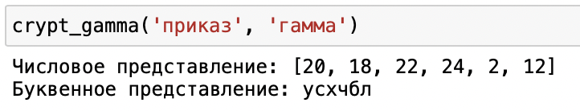
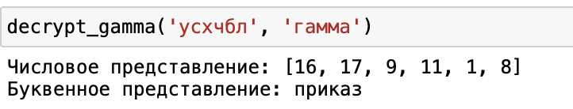

---
# Front matter
title: "Отчёт по лабораторной работе №3"
subtitle: "Шифр гаммирования"
author: "Логинов Сергей НФИмд 01-22"

# Generic otions
lang: ru-RU
toc-title: "Содержание"

# Bibliography
bibliography: bib/cite.bib
csl: pandoc/csl/gost-r-7-0-5-2008-numeric.csl

# Pdf output format
toc: true # Table of contents
toc_depth: 2
lof: true # List of figures
fontsize: 12pt
linestretch: 1.5
papersize: a4
documentclass: scrreprt
## I18n
polyglossia-lang:
  name: russian
  options:
	- spelling=modern
	- babelshorthands=true
polyglossia-otherlangs:
  name: english
### Fonts
mainfont: PT Serif
romanfont: PT Serif
sansfont: PT Sans
monofont: PT Mono
mainfontoptions: Ligatures=TeX
romanfontoptions: Ligatures=TeX
sansfontoptions: Ligatures=TeX,Scale=MatchLowercase
monofontoptions: Scale=MatchLowercase,Scale=0.9
## Biblatex
biblatex: true
biblio-style: "gost-numeric"
biblatexoptions:
  - parentracker=true
  - backend=biber
  - hyperref=auto
  - language=auto
  - autolang=other*
  - citestyle=gost-numeric
## Misc options
indent: true
header-includes:
  - \linepenalty=10 # the penalty added to the badness of each line within a paragraph (no associated penalty node) Increasing the value makes tex try to have fewer lines in the paragraph.
  - \interlinepenalty=0 # value of the penalty (node) added after each line of a paragraph.
  - \hyphenpenalty=50 # the penalty for line breaking at an automatically inserted hyphen
  - \exhyphenpenalty=50 # the penalty for line breaking at an explicit hyphen
  - \binoppenalty=700 # the penalty for breaking a line at a binary operator
  - \relpenalty=500 # the penalty for breaking a line at a relation
  - \clubpenalty=150 # extra penalty for breaking after first line of a paragraph
  - \widowpenalty=150 # extra penalty for breaking before last line of a paragraph
  - \displaywidowpenalty=50 # extra penalty for breaking before last line before a display math
  - \brokenpenalty=100 # extra penalty for page breaking after a hyphenated line
  - \predisplaypenalty=10000 # penalty for breaking before a display
  - \postdisplaypenalty=0 # penalty for breaking after a display
  - \floatingpenalty = 20000 # penalty for splitting an insertion (can only be split footnote in standard LaTeX)
  - \raggedbottom # or \flushbottom
  - \usepackage{float} # keep figures where there are in the text
  - \floatplacement{figure}{H} # keep figures where there are in the text
---

# Цель работы

Изучение алгоритма шифрования гаммированием

# Теоретические сведения

## Шифр гаммирования

Гаммирование – это наложение (снятие) на открытые (зашифрованные) данные криптографической гаммы, т.е. последовательности элементов данных, вырабатываемых с помощью некоторого криптографического алгоритма, для получения зашифрованных (открытых) данных.

Принцип шифрования гаммированием заключается в генерации гаммы шифра с помощью датчика псевдослучайных чисел и наложении полученной гаммы шифра на открытые данные обратимым образом (например, используя операцию сложения по модулю 2). Процесс дешифрования сводится к повторной генерации гаммы шифра при известном ключе и наложении такой же гаммы на зашифрованные данные.
Полученный зашифрованный текст является достаточно трудным для раскрытия в том случае, если гамма шифра не содержит повторяющихся битовых последовательностей и изменяется случайным образом для каждого шифруемого слова. Если период гаммы превышает длину всего зашифрованного текста и неизвестна никакая часть исходного текста, то шифр можно раскрыть только прямым перебором (подбором ключа). В этом случае криптостойкость определяется размером ключа.

Метод гаммирования становится бессильным, если известен фрагмент исходного текста и соответствующая ему шифрограмма. В этом случае простым вычитанием по модулю 2 получается отрезок псевдослучайной последовательности и по нему восстанавливается вся эта последовательность.

Метод гаммирования с обратной связью заключается в том, что для получения сегмента гаммы используется контрольная сумма определенного участка шифруемых данных. Например, если рассматривать гамму шифра как объединение непересекающихся множеств H(j), то процесс шифрования можно пердставить следующими шагами:

1. Генерация сегмента гаммы H(1) и наложение его на соответствующий участок шифруемых данных.

2. Подсчет контрольной суммы участка, соответствующего сегменту гаммы H(1).

3. Генерация с учетом контрольной суммы уже зашифрованного участка данных следующего сегмента гамм H(2).

4. Подсчет контрольной суммы участка данных, соответствующего сегменту данных H(2) и т.д.

# Выполнение работы


## Шифрование
```
# задаем алфавит
alph = 'абвгдежзийклмнопрстуфхцчшщъыьэюя'
# создаем словари формата число-буква и буква-число
dict = {}
for i in range(1, 33):
    dict[i] = alph[i - 1]
dict1 = {v: k for k, v in dict.items()}
# меняем местами для удобства
dict, dict1 = dict1, dict

# функция шифрования
def crypt_gamma(word, key):
    a = []
    for i in range(len(word)):
        try:
            a.append(dict[word[i]] + dict[key[i]])
        except:
            a.append(dict[word[i]] + dict[key[i % len(key)]])
    print('Числовое представление:', a)
    crypto = ''
    for i in a:
        crypto += dict1[i]
    print('Буквенное представление:', crypto)

crypt_gamma('приказ', 'гамма')
```
### Результат выполнения
{ #fig:001 width=70% height=70%}

## Дешифровка
```
# функция дешифровки
def decrypt_gamma(crypto, key):
    a = []
    for i in range(len(word)):
        try:
            a.append(dict[word[i]] - dict[key[i]])
        except:
            a.append(dict[word[i]] - dict[key[i % len(key)]])
    print('Числовое представление:', a)
    crypto = ''
    for i in a:
        crypto += dict1[i]
    print('Буквенное представление:', crypto)

decrypt_gamma('усхчбл', 'гамма')
```
### Результат выполнения
{ #fig:001 width=70% height=70%}

# Выводы

Изучили алгоритмы шифрования на основе гаммирования

# Список литературы

1. [Шифрование методом гаммирования](http://altaev-aa.narod.ru/security/XOR.html)
2. [Режим гаммирования в блочном алгоритме шифрования](https://kabinfo.ucoz.ru/index/shifr_reshetka_kardano/0-374)