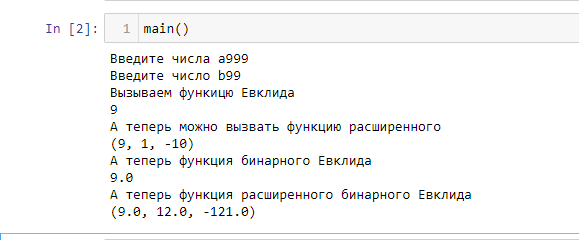

---
# Front matter
title: "Отчёт по лабораторной работе №4"
subtitle: "Алгоритм Евклида"
author: "Логинов Сергей НФИмд 01-22"

# Generic otions
lang: ru-RU
toc-title: "Содержание"

# Bibliography
bibliography: bib/cite.bib
csl: pandoc/csl/gost-r-7-0-5-2008-numeric.csl

# Pdf output format
toc: true # Table of contents
toc_depth: 2
lof: true # List of figures
fontsize: 12pt
linestretch: 1.5
papersize: a4
documentclass: scrreprt
## I18n
polyglossia-lang:
  name: russian
  options:
	- spelling=modern
	- babelshorthands=true
polyglossia-otherlangs:
  name: english
### Fonts
mainfont: PT Serif
romanfont: PT Serif
sansfont: PT Sans
monofont: PT Mono
mainfontoptions: Ligatures=TeX
romanfontoptions: Ligatures=TeX
sansfontoptions: Ligatures=TeX,Scale=MatchLowercase
monofontoptions: Scale=MatchLowercase,Scale=0.9
## Biblatex
biblatex: true
biblio-style: "gost-numeric"
biblatexoptions:
  - parentracker=true
  - backend=biber
  - hyperref=auto
  - language=auto
  - autolang=other*
  - citestyle=gost-numeric
## Misc options
indent: true
header-includes:
  - \linepenalty=10 # the penalty added to the badness of each line within a paragraph (no associated penalty node) Increasing the value makes tex try to have fewer lines in the paragraph.
  - \interlinepenalty=0 # value of the penalty (node) added after each line of a paragraph.
  - \hyphenpenalty=50 # the penalty for line breaking at an automatically inserted hyphen
  - \exhyphenpenalty=50 # the penalty for line breaking at an explicit hyphen
  - \binoppenalty=700 # the penalty for breaking a line at a binary operator
  - \relpenalty=500 # the penalty for breaking a line at a relation
  - \clubpenalty=150 # extra penalty for breaking after first line of a paragraph
  - \widowpenalty=150 # extra penalty for breaking before last line of a paragraph
  - \displaywidowpenalty=50 # extra penalty for breaking before last line before a display math
  - \brokenpenalty=100 # extra penalty for page breaking after a hyphenated line
  - \predisplaypenalty=10000 # penalty for breaking before a display
  - \postdisplaypenalty=0 # penalty for breaking after a display
  - \floatingpenalty = 20000 # penalty for splitting an insertion (can only be split footnote in standard LaTeX)
  - \raggedbottom # or \flushbottom
  - \usepackage{float} # keep figures where there are in the text
  - \floatplacement{figure}{H} # keep figures where there are in the text
---

# Цель работы

Изучение алгоритма Евклида нахождения НОД и его вариаций.

# Теоретические сведения

## Наибольший общий делитель

Наибольший общий делитель (НОД) – это число, которое делит без остатка два числа и делится само без остатка на любой другой делитель данных двух чисел. Проще говоря, это самое большое число, на которое можно без остатка разделить два числа, для которых ищется НОД.

## Алгоритм Евклида

При работе с большими составными числами их разложение на простые множители, как правило, неизвестно. 
Но для многих прикладных задач теории чисел поиск разложения числа на множители является важной, часто встречающейся практической задачей. 
В теории чисел существует сравнительно быстрый способ вычисления НОД двух чисел, который называется алгоритмом Евклида.

Алгоритм Евклида

* Вход. Целые числа $a, b; 0 < b < a$.
* Выход. $d =$ НОД$(a,b)$.

1. Положить $r_0 = a$, $r_1 = b$, $i = 1$.
2. Найти остаток $r_i+1$ от деления $r_i–1$ на $r_i$.
3. Если $r_i+1 = 0$, то положить $d = r_i$. В противном случае положить $i = i+1$ и вернуться на шаг 2.
4. Результат: $d$.

Пример: Найти НОД для 30 и 18.

30 / 18 = 1 (остаток 12)

18 / 12 = 1 (остаток 6)

12 / 6 = 2 (остаток 0)

Конец: НОД – это делитель 6.

## Бинарный алгоритм Евклида

Бинарный алгоритм Евклида вычисления НОД оказывается более быстрым при реализации этого алгоритма на компьютере, поскольку использует двоичное представление чисел а и b. 
Бинарный алгоритм Евклида основан на следующих свойствах наибольшего общего делителя (считаем, что 0 < b ≤ а):

* Вход. Целые числа $a, b; 0 < b ≤ a$.
* Выход. $d =$ HOД$(a,b)$.

1. Положить $g = 1$.
2. Пока оба числа $a$ и $b$ четные, выполнять $a = a/2, b = b/2, g = 2g$ до получения хотя бы одного нечетного значения $a$ или $b$.
3. Положить $u = a, v = b$.
4. Пока $u \neq 0$, выполнять следующие действия.
	- Пока $u$ четное, полагать $u = u/2$.
	- Пока $v$ четное, полагать $v = v/2$.
	- При $u \geq v$ положить $u = u - v$. В противном случае положить $v = v – u$.
5. Положить $d = gv$.
6. Результат: $d$

## Расширенный алгоритм Евклида

Расширенный алгоритм Евклида находит наибольший общий делитель d чисел а и b и его линейное представление, т. е. целые числа x и у, для которых ах + by = d, и не требует «возврата», как в рассмотренном примере.
Пусть d – НОД для a и b, т. е. d = (a, b), где a > b.
Тогда существуют такие целые числа x и y, что d = ax +by. 
Иными словам, НОД двух чисел можно представить в виде линейной комбинации этих чисел с целыми коэффициентами

* Вход. Целые числа $a, b; 0 < b ≤ a$.
* Выход: $d =$ НОД$(a, b)$; такие целые числа $x, y$, что $ax + by = d$.

1. Положить $r_0 = a, r_1 = b, x_0 = 1, x_1 = 0, y_0 = 0, y_1 = 1, i = 1$
2. Разделить с остатком $r_i–1$ на $r_i$ : $r_(i–1) = q_i*r_i + r_i + 1$
3. Если $r_(i+1) = 0$, то положить $d = r_i$, $x = x_i$, $y = y_i$. В противном случае положить $x_(i+1) = (x_(i–1) – q_i*x_i$, $y_(i+1) = y_(i–1) – q_i*y_i$, $i = i + 1$ и вернуться на шаг 2.
4. Результат: $d, x, y$.

# Выполнение работы

## Реализация алгоритмов на языке Python

```
# функция уменьшает число до тех пор пока одно из них не станет нулем
# практически для этого используется цикл
def evklidsimply(a,b):
    while a != 0 and b != 0:
        if a >= b:
            a %= b
        else:
            b %= a
    return a or b

#  функция расширенного евклида
# ax + by = gcd(a,b)
# алгоритм находит нод и его линейное представление

def evklid_extended(a, b):
    if a == 0:
        return (b, 0, 1)
    else:
        div, x, y = evklid_extended(b % a, a)
    return (div, y - (b // a) * x, x)

# функция бинарного евклида
def binary_evklid(a,b):
    g = 1  # переменная для подсчета
    # согласно условиям и пунктам задачи мы все делаем
    # по пунктам
    while(a % 2 == 0 and b % 2 == 0):
        a = a/2
        b = b/2
        g = 2*g
    u,v = a,b
    while u != 0:
        if u % 2 == 0:
            u = u/2
        if v % 2 == 0:
            v = v/2
        if u >= v:
            u = u - v
        else:
            v = v - u
    d = g*v
    return d

# функция расширенного бинарного евклида
def evklid_binary_extended(a, b):
    g = 1 # переменная для подсчетов
    # выполняем все согласно алгоритму
    
    while (a % 2 == 0 and b % 2 == 0):
        a = a / 2
        b = b / 2
        g = 2 * g
    u = a
    v = b
    A = 1
    B = 0
    C = 0
    D = 1
    while u != 0:
        if u % 2 == 0:
            u = u/2
            if A % 2 == 0 and B % 2 ==0:
                A = A/2
                B = B/2
            else:
                A = (A+b)/2
                B = (B-a)/2
        if v % 2 == 0:
            v = v / 2
            if C%2==0 and D%2==0:
                C = C/2
                D = D/2
            else:
                C = (C+b)/2
                D = (D-a)/2
        if u>=v:
            u = u - v
            A = A - C
            B = B - D
        else:
            v = v - u
            C = C - A
            D = D - B
    d = g*v
    x = C
    y = D
    return (d,x,y)

def main():
    # положим числа в переменные
    a = int(input("Введите числа a"))
    b = int(input("Введите число b"))
    if a >= 0 and 0 <= b <= a: 
	# проверяем условия что все в порядке(согласно условиям задачи
        print("Вызываем функицю Евклида")
        print(evklidsimply(a,b)) 
		# вызываем функцию простого евклида
        print("А теперь можно вызвать функцию расширенного")
        print(evklid_extended(a,b)) 
		# вызываем функцию расширенного евклида
        print("А теперь функция бинарного Евклида")
        print(binary_evklid(a,b)) 
		# вызываем функцию бинарного евклида
        print("А теперь функция расширенного бинарного Евклида")
        print(evklid_binary_extended(a,b)) 
		# вызываем функцию расширенного бинарного евклида
```

## Контрольный пример

{ #fig:001 }

# Выводы

Изучили алгоритм Евклида нахождения НОД.

# Список литературы

1. [ВЫЧИСЛЕНИЕ НАИБОЛЬШЕГО ОБЩЕГО ДЕЛИТЕЛЯ](http://ikit.edu.sfu-kras.ru/files/15/l2.pdf)
2. [В очередной раз о НОД](https://habr.com/ru/post/464949/)