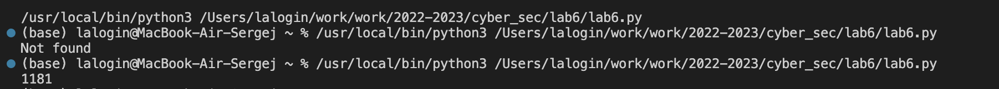

---
## Front matter
lang: ru-RU
title: Разложение чисел на множители
author: Логинов Сергей НФИмд 01-22
institute: Российский Университет Дружбы Народов
date: 26 ноября, 2022, Москва, Россия

## Formatting
mainfont: PT Serif
romanfont: PT Serif
sansfont: PT Sans
monofont: PT Mono
toc: false
slide_level: 2
theme: metropolis
header-includes: 
 - \metroset{progressbar=frametitle,sectionpage=progressbar,numbering=fraction}
 - '\makeatletter'
 - '\beamer@ignorenonframefalse'
 - '\makeatother'
aspectratio: 43
section-titles: true

---

# Цели и задачи

## Цель лабораторной работы

Изучение задачи разложения на множители, изучение p-алгоритма Поллрада.

# Выполнение лабораторной работы

## Задача разложения на простые множители

Разложение на множители — предмет непрерывного исследования в прошлом; и такие же исследования, вероятно, продолжатся в будущем. Разложение на множители играет очень важную роль в безопасности некоторых криптосистем с открытым ключом.

## p-алгоритм Поллрада

* Вход. Число $n$, начальное значение $c$, функция $f$, обладающая сжимающими свойствами.
* Выход. Нетривиальный делитель числа $n$.

1. Положить $a=c, b=c$
2. Вычислить $a=f(a)(mod n), b=f(b)(mod n)$
3. Найти $d = GCD(a-b, n)$
4. Если $1<d<n$, то положить $p=d$ и результат: $p$. При $d=n$ результат: ДЕЛИТЕЛЬ НЕ НАЙДЕН. При $d=1$ вернуться на шаг 2.

## Оценка сложности

Сложность. Заметим, что этот метод требует сделать $B – 1$ операций возведения в степень $a = a^e mod n$. Есть быстрый алгоритм возведения в степень, который выполняет это за $2*1og_2 B$ операций. Метод также использует вычисления НОД, который требует $n^3$ операций. Мы можем сказать, что сложность — так или иначе больше, чем $O(B)$ или $O(2^n)$, где $n_b$ — число битов в $B$. Другая проблема – этот алгоритм может заканчиваться сигналом об ошибке. Вероятность успеха очень мала, если $B$ имеет значение, не очень близкое к величине $\sqrt{n}$.

## Пример работы алгоритма

# Выводы

## Результаты выполнения лабораторной работы

Изучили задачу разложения на множители и p-алгоритм Поллрада.