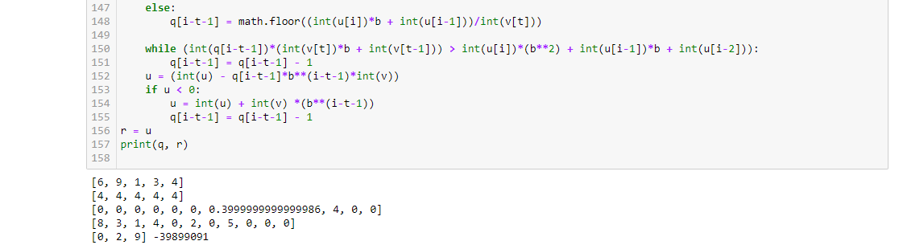

---
# Front matter
title: "Отчёт по лабораторной работе №8"
subtitle: "Целочисленная арифметика многократной точности"
author: "Логинов Сергей НФИмд 01-22"

# Generic otions
lang: ru-RU
toc-title: "Содержание"

# Bibliography
bibliography: bib/cite.bib
csl: pandoc/csl/gost-r-7-0-5-2008-numeric.csl

# Pdf output format
toc: true # Table of contents
toc_depth: 2
lof: true # List of figures
fontsize: 12pt
linestretch: 1.5
papersize: a4
documentclass: scrreprt
## I18n
polyglossia-lang:
  name: russian
  options:
	- spelling=modern
	- babelshorthands=true
polyglossia-otherlangs:
  name: english
### Fonts
mainfont: PT Serif
romanfont: PT Serif
sansfont: PT Sans
monofont: PT Mono
mainfontoptions: Ligatures=TeX
romanfontoptions: Ligatures=TeX
sansfontoptions: Ligatures=TeX,Scale=MatchLowercase
monofontoptions: Scale=MatchLowercase,Scale=0.9
## Biblatex
biblatex: true
biblio-style: "gost-numeric"
biblatexoptions:
  - parentracker=true
  - backend=biber
  - hyperref=auto
  - language=auto
  - autolang=other*
  - citestyle=gost-numeric
## Misc options
indent: true
header-includes:
  - \linepenalty=10 # the penalty added to the badness of each line within a paragraph (no associated penalty node) Increasing the value makes tex try to have fewer lines in the paragraph.
  - \interlinepenalty=0 # value of the penalty (node) added after each line of a paragraph.
  - \hyphenpenalty=50 # the penalty for line breaking at an automatically inserted hyphen
  - \exhyphenpenalty=50 # the penalty for line breaking at an explicit hyphen
  - \binoppenalty=700 # the penalty for breaking a line at a binary operator
  - \relpenalty=500 # the penalty for breaking a line at a relation
  - \clubpenalty=150 # extra penalty for breaking after first line of a paragraph
  - \widowpenalty=150 # extra penalty for breaking before last line of a paragraph
  - \displaywidowpenalty=50 # extra penalty for breaking before last line before a display math
  - \brokenpenalty=100 # extra penalty for page breaking after a hyphenated line
  - \predisplaypenalty=10000 # penalty for breaking before a display
  - \postdisplaypenalty=0 # penalty for breaking after a display
  - \floatingpenalty = 20000 # penalty for splitting an insertion (can only be split footnote in standard LaTeX)
  - \raggedbottom # or \flushbottom
  - \usepackage{float} # keep figures where there are in the text
  - \floatplacement{figure}{H} # keep figures where there are in the text
---

# Цель работы

Ознакомление с алгоритмами целочисленной арифметики многократной точности, а также их последующая программная реализация.

# Теоретические сведения

Высокоточная (длинная) арифметика — это операции (базовые арифметические действия, 
элементарные математические функции и пр.) над числами большой разрядности 
(многоразрядными числами), т.е. числами, разрядность которых превышает 
длину машинного слова универсальных процессоров общего назначения (более 128 бит).

В современных асимметричных криптосистемах в качестве ключей, как правило, 
используются целые числа длиной 1000 и более битов. 
Для задания чисел такого размера не подходит ни один стандартный целочисленный 
тип данных современных языков программирования. Представление чисел в формате 
с плавающей точкой позволяет задать очень большие числа 
(например, тип long double языка C++ -- до $10^{5000}$), 
но не удовлетворяет требованию абсолютной точности, 
характерному для криптографических приложений. Поэтому большие целые числа 
представляются в криптографических пакетах в виде последовательности цифр 
в некоторой системе счисления (обозначим основание системы счисления $b$): $x = (x_{n-1} x_{n-2} \ldots x_1 x_0)_b,
$ где $\forall i \in [0, n - 1]: 0 \le x_i < b$.

Основание системы счисления $b$ выбирается так, чтобы существовали машинные команды 
для работы с однозначными и двузначными числами; как правило, $b$ равно $2^8$, $2^{16}$ или $2^{32}$.

При работе с большими целыми числами знак такого числа удобно хранить 
в отдельной переменной. Например, при умножении двух чисел знак произведения вычисляется отдельно.

Далее при описании алгоритмов квадратные скобки означают, что берётся целая часть числа.

## Сложение неотрицательных целых чисел

*Вход. Два неотрицательных числа $u = u_1 u_2 \ldots u_n$ и $v = v_1 v_2 \ldots v_n$; разрядность чисел $n$; основание системы счисления $b$.

*Выход. Сумма $w = w_0 w_1 \ldots w_n$, где $w_0$ - цифра переноса, всегда равная $0$ либо $1$.

1. Присвоить $j = n, k = 0$ (*$j$ идет по разрядам, $k$ следит за переносом*).
2. Присвоить $w_j = (u_j + v_j + k) \pmod{b}$, где $k = \left[ \frac{u_j + v_j + k}{b} \right]$.
3. Присвоить $j = j - 1$. Если $j > 0$, то возвращаемся на шаг 2; если $j = 0$, то присвоить $w_0 = k$ и результат: $w$.

## Вычитание неотрицательных целых чисел

*Вход. Два неотрицательных числа $u = u_1 u_2 \ldots u_n$ и $v = v_1 v_2 \ldots v_n$, $u > v$; разрядность чисел $n$; основание системы счисления $b$.

*Выход. Разность $w = w_0 w_1 \ldots w_n = u - v$.

1. Присвоить $j = n, k = 0$ ($k$ -- заём из старшего разряда).
2. Присвоить $w_j = (u_j - v_j + k) \pmod{b}$; $k = \left[ \frac{u_j - v_j + k}{b} \right]$.
3. Присвоить $j = j - 1$. Если $j > 0$, то возвращаемся на шаг 2; если $j = 0$, то результат: $w$.

## Умножение неотрицательных целых чисел столбиком

*Вход. Числа $u = u_1 u_2 \ldots u_n$, $v = v_1 v_2 \ldots v_m$; основание системы счисления $b$.

*Выход. Произведение $w = uv = w_1 w_2 \ldots w_{m+n}$.

1. Выполнить присвоения: $w_{m+1} = 0, w_{m+2} = 0, \ldots, w_{m+n} = 0, j = m$ (*$j$ перемещается по номерам разрядов числа $v$ от младших к старшим*).
2. Если $v_j = 0$, то присвоить $w_j = 0$ и перейти на шаг 6.
3. Присвоить $i = n, k = 0$ (*значение $i$ идет по номерам разрядов числа $u$, $k$ отвечает за перенос*).
4. Присвоить $t = u_i \cdot v_j + w_{i+j} + k, w_{i+j} = t \pmod{b}, k = \left[ \frac{t}{b} \right]$.
5. Присвоить $i = i - 1$. Если $i > 0$, то возвращаемся на шаг 4, иначе присвоить $w_j = k$.
6. Присвоить $j = j - 1$. Если $j > 0$, то вернуться на шаг 2. Если $j = 0$, то результат: $w$.

## Быстрый столбик

*Вход. Числа $u = u_1 u_2 \ldots u_n$, $v = v_1 v_2 \ldots v_m$; основание системы счисления $b$.

*Выход. Произведение $w = uv = w_1 w_2 \ldots w_{m+n}$.

1. Присвоить $t = 0$.
2. Для $s$ от $0$ до $m + n - 1$ с шагом 1 выполнить шаги 3 и 4.
3. Для $i$ от $0$ до $s$ с шагом 1 выполнить присвоение $t~=~t~+~u_{n - i}~\cdot~v_{m - s + i}$.
4. Присвоить $w_{m + n - s} = t \pmod{b}, t = \left[ \frac{t}{b} \right]$. Результат: $w$.

## Деление многоразрядных целых чисел

*Вход. Числа $u = u_n \ldots u_1 u_0$, $v = v_t \ldots v_1 v_0, n \ge t \ge 1, v_t \ne 0$.

*Выход. Частное $q = q_{n-t} \ldots q_0$, остаток $r = r_t \ldots r_0$.

1. Для $j$ от $0$ до $n - t$ присвоить $q_j = 0$.
2. Пока $u \ge v b^{n - t}$, выполнять: $q_{n - t} = q_{n - t} + 1, u = u - v b^{n - t}$.
3. Для $i = n, n - 1, \ldots, t + 1$ выполнять пункты 3.1 -- 3.4:
	3.1. если $u_i \ge v_t$, то присвоить $q_{i - t - 1} = b - 1$, иначе присвоить $q_{i - t - 1} = \frac{u_i b + u_{i - 1}}{v_t}$.
	3.2. пока $q_{i - t - 1} (v_t b + v_{t - 1}) > u_i b^2 + u_{i - 1} b + u_{i - 2}$ выполнять $q_{i - t - 1} = q_{i - t - 1} - 1$.
	3.3. присвоить $u = u - q_{i - t - 1} b^{i - t - 1} v$.
	3.4. если $u < 0$, то присвоить $u = u + v b^{i - t - 1}$, $q_{i - t - 1}~=~q_{i - t - 1}~-~1$.
4. $r = u$. Результат: $q$ и $r$.

# Выполнение работы

## Реализация алгоритма на языке Python

```
import math
u = "12345"
v = "56789"
b = 10
n = 5
# алгоритм 1
j = n
k = 0

w = list()
for i in range(1, n+1):
    w.append(
        (int(u[n-i]) + int(v[n-i]) + k) % b
    )

    k = (int(u[n-i]) + int(v[n-i]) + k)//b
    j = j - 1
w.reverse()
print(w)

# алгоритм 2
u = "56789"
v = "12345"

j = n
k = 0
w = list()
for i in range(1, n+1):
    w.append(
        (int(u[n-i]) - int(v[n-i]) + k) % b
    )

    k = (int(u[n-i]) - int(v[n-i]) + k)//b
    j = j - 1
w.reverse()
print(w)

# алгоритм 3
u = "123456"
v = "7890"
n = 6
m = 4

w = list()
for i in range(m+n):
    w.append(0)
j = m


def step6():
    global j
    global w
    j = j - 1
    if j > 0:
        step2()
    if j == 0:
        print(w)


def step2():
    global v
    global w
    global j
    if j == m:
        j = j-1
    if int(v[j]) == 0:
        w[j] = 0
        step6()


def step4():
    global k
    global t
    global i
    if i == n:
        i = i - 1
    t = int(u[i]) * int(v[j]) + w[i + j] + k
    w[i + j] = t % b
    k = t / b


def step5():
    global i
    global w
    global j
    global k
    i = i - 1
    if i > 0:
        step4()
    else:
        w[j] = k


step2()
i = n
k = 0
t = 1
step4()
step5()
step6()
print(w)


# алгоритм 4
u4 = "12345"
n = 5
v4 = "6789"
m = 4
b = 10
w1 = list()
for i in range(m+n+2):
    w1.append(0)
t1 = 0
for s1 in range(0, m+n):
    for i1 in range(0, s1+1):
        if n-i1>n or m-s1+i1>m or n-i1<0 or m-s1+i1<0 or m-s1+i1-1<0:
            continue
        t1 = t1 + (int(u[n-i1-1]) * int(v[m-s1+i1-1]))
    w1[m+n-s1-1] = t1 % b
    t1 = math.floor(t1/b)
print(w1)


# алгоритм 5
u = "12346789"
n = 7
v = "56789"
t = 4
b = 10
q = list()
for j in range(n-t):
    q.append(0)
r = list()
for j in range(t):
    r.append(0)

while int(u) >= int(v)*(b**(n-t)):
    q[n-t] = q[n-t] + 1
    u = int(u) - int(v)*(b**(n-t))
u = str(u)
for i in range(n, t+1, -1):
    v = str(v)
    u = str(u)
    if int(u[i]) > int(v[t]):
        q[i-t-1] = b - 1
    else:
        q[i-t-1] = math.floor((int(u[i])*b + int(u[i-1]))/int(v[t]))

    while (int(q[i-t-1])*(int(v[t])*b + int(v[t-1])) > int(u[i])*(b**2) + int(u[i-1])*b + int(u[i-2])):
        q[i-t-1] = q[i-t-1] - 1
    u = (int(u) - q[i-t-1]*b**(i-t-1)*int(v))
    if u < 0:
        u = int(u) + int(v) *(b**(i-t-1))
        q[i-t-1] = q[i-t-1] - 1
r = u
print(q, r)
```

## Контрольный пример

{ #fig:001 }

# Выводы

Изучили задачу представления больших чисел, познакомились с вычислительными алгоритмами.

# Список литературы{.unnumbered}

1. [Длинная арифметика от Microsoft](https://habr.com/ru/post/207754/)
2. [Как оперировать числами, не помещающимися ни в один из числовых типов](https://programforyou.ru/poleznoe/dlinnaya-arifmetika-kak-operirovat-chislami-ne-pomeshchayushchimisya-ni-v-odin-iz-chislovyh-tipov)